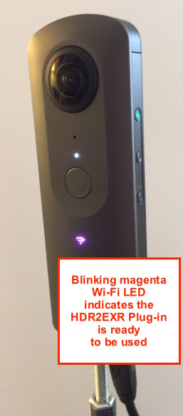

## HDR2EXR Plug-in Installation

Are you in the visual special effects field? Do you own a RICOH THETA V and use it to gather lighting information to apply to CGI models?

With the HDR2EXR Plug-in, one button push gets you 11 bracketed images and outputs an EXR file with the lighting information you need.

### Who can use this?

This installation information is intended for VFX professionals who own a RICOH THETA V and do not mind a little one-time effort installing and configuring software. 

### Quick Overview

The RICOH THETA V 360 degree camera is used regularly in VFX to grab lighting information. It is an extremely portable, high quality, low-cost device that can allow you to jump into a scene on-site without slowing down production. But it still takes some effort configuring the RICOH THETA mobile app on your smartphone/tablet and you need to combine the images later into EXR or other HDR formats.

THE THETA V has the ability to run "plug-ins" inside the camera. These can customize how the camera is used. Often, a plug-in will add multiple pre-defined steps to one button press, saving time and effort.

This HDR2EXR plug-in, developed by Kasper Oerlemans, is not submitted to the THETA Store yet, so it needs to be installed manually. This requires a series of steps which are not hard but take probably 10-15 minutes for the first-time one-time setup.

### Steps for Beginners

If this is your first time using a plug-in, you're in the right place. If you've already installed an apk in your THETA, you can jump to the Using the Plug-in section.

First, just a couple of points to clarify. The RICOH THETA V can use "plug-ins."" Any THETA V owner can go to the Plug-in Store and install a plug-in and use it. Currently, all plug-ins are free of charge. There are plug-ins that allow you to take longer videos (normally limited to 25 minutes), plug-ins that shoot your pictures and video into VR googles over Wi-Fi, plug-ins that allow you to grab the images in two halves (fisheye) to increase speed or improve the stitching line, and lots more. You can install as many as you want. You can only use one at a time. You can see the list of what's installed in your THETA V and pick which one you're using in the THETA mobile app.

However, there are a lot of plug-ins that are not in the store. They come as apks (Android Package format). Same idea, but they require more steps for installing and using. First of all, you must have an "unlocked" THETA V. This is not hard, you register with the THETA Plug-in Partners program, send in a picture of your Serial Number (on the bottom of your THETA) and then unlock it using your THETA desktop app. Then you will need to install the apk. This requires connecting by USB and using adb (Android Debug Bridge) and a few commands. Then, you will use Vysor, which allows you to remotely control and view content on an Android device, to set permissions for the apk. Even for non-developers, it's not hard. Applying to the partner program can have a delay of several days. Install the apk requires a one-time setup that normally takes 10-15 minutes.

### Installing the HDR2EXR Plug-in

